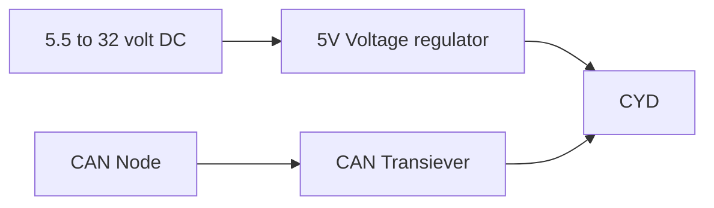
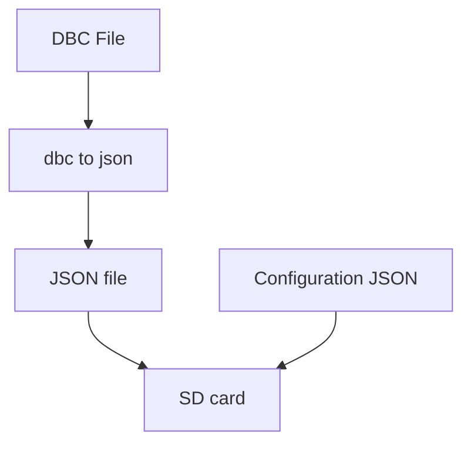

# ESP32 CAN Bus Dashboard (CYD)

A lightweight CAN bus monitor and dashboard built using the **Cheap Yellow Display (ESP32-2432S028R)** and an external CAN transceiver. This project leverages the ESP32's built-in **TWAI (Two-Wire Automotive Interface)** to sniff, decode, and display real-time vehicle or industrial bus data.

## 🚀 Features
* **Real-time Monitoring:** Captures CAN frames at 500kbits/s (configurable).
* **Visual Feedback:** Displays specific data bytes directly on the 2.8" integrated TFT screen.
* **Serial Debugging:** Full hex dump of incoming messages via Serial Monitor.
* **Error Handling:** Visual and serial alerts for bus errors and queue overflows.

---

## 🛠 Hardware Requirements
Prototype board.

3D render of version 1 PCB.

| Module                                   | Link                                                         |
| :---------                               | :--------------                                              |
| SN65HVD230 VP230 CAN Bus Transceiver     | [Link to module](https://s.click.aliexpress.com/e/_c3WuskX7) |
| ESP32 Development Board 2.8inch **CYD**  | [Link to module](https://s.click.aliexpress.com/e/_c4rNTV7J) |
| Mini560 Pro 5A DC-DC Step Down 5V        | [Link to module](https://s.click.aliexpress.com/e/_c37COh3J) |

### Wiring Table
| CYD Pin    | Transceiver Pin | Function     |
| :--------- | :-------------- | :----------- |
| **GPIO 22**| TX              | CAN Transmit |
| **GPIO 27**| RX              | CAN Receive  |
| **3V3**    | VCC             | Power        |
| **GND**    | GND             | Ground       |

---

## 💻 Software Setup

The program requires the DBC to be converted to a JSON file (use this converter [viriciti
dbc-to-json](https://viriciti.github.io/dbc-to-json/))

Then setup the configuration.json file with the signals you want to show, se example in repo.

### Dependencies
* **TFT_eSPI**: Required for the ILI9341 display. 
* **Note:** You must configure your `User_Setup.h` for the CYD. See [this guide](https://github.com/witnessmenow/ESP32-Cheap-Yellow-Display/blob/main/SetupGuide.md) for the specific pin definitions.

### Configuration
To change the CAN speed, modify this line in the `setup()` function:
`twai_timing_config_t t_config = TWAI_TIMING_CONFIG_500KBITS();`

---

## 🔍 How It Works
The code initializes the ESP32 TWAI driver in **Normal Mode**. 
* **Serial Monitor:** Prints the Message ID and all 8 data bytes in Hex format.
* **TFT Screen:** Real-time update of specific payload data (Bytes 6 and 7).

---

## 📝 License
Distributed under the MIT License.

---

## ✨ Future Improvements
- [ ] Add touch-screen buttons to cycle through CAN IDs.
- [ ] Add a graphical gauge for RPM/Speed.
- [ ] SD card logging support.
