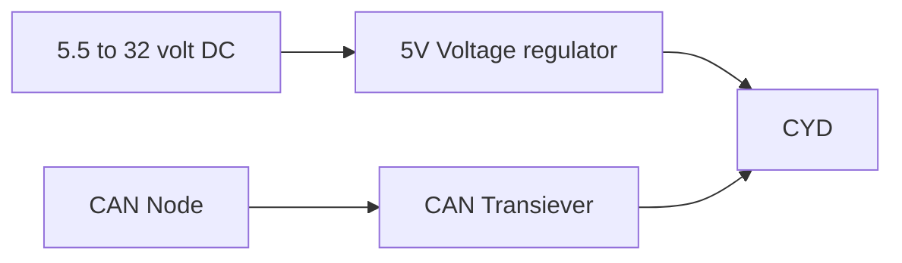
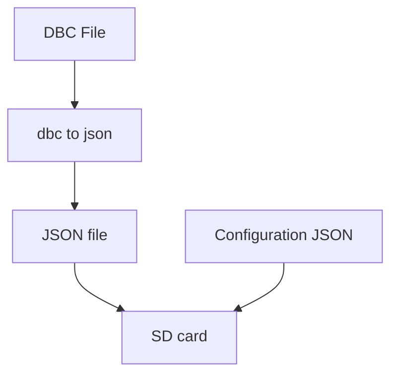

# 📟 CYD CAN DASH (ESP32)

**CYD CAN DASH** is a dynamic, high-performance CAN bus monitoring dashboard designed for the **Cheap Yellow Display (ESP32-2432S028R)**. Unlike static sniffers, this project uses an SD-card-based configuration system to decode and display specific signals from a **DBC (Database CAN)** file in real-time.


## ✨ Key Features

* Dynamic Signal Parsing: Decodes Motorola (Big Endian) bit-parsing logic directly from CAN frames.
* SD-Card Configuration: Swap dashboards by simply editing a configuration.json file on your SD card.
* Automotive-Grade Driver: Built on the ESP32’s native TWAI (Two-Wire Automotive Interface) driver.
* Hardware Diagnostics: Built-in boot sequence that verifies SD card health and displays chip-level system info.
* Robust Error Handling: Real-time visual alerts for bus errors, passive states, and RX queue overflows.



---

## 🛠 Hardware Requirements
Prototype board.


3D render of version 1 PCB.


## Component List

| Module                                   | Link                                                         |
| :---------                               | :--------------                                              |
| SN65HVD230 VP230 CAN Bus Transceiver     | [Link to module](https://s.click.aliexpress.com/e/_c3WuskX7) |
| ESP32 Development Board 2.8inch **CYD**  | [Link to module](https://s.click.aliexpress.com/e/_c4rNTV7J) |
| Mini560 Pro 5A DC-DC Step Down 5V        | [Link to module](https://s.click.aliexpress.com/e/_c37COh3J) |


## Wiring Table
| CYD Pin    | Transceiver Pin | Function     |
| :--------- | :-------------- | :----------- |
| **GPIO 22**| TX              | CAN Transmit |
| **GPIO 27**| RX              | CAN Receive  |
| **3V3**    | VCC             | Power        |
| **GND**    | GND             | Ground       |

---

## 💻 Software Architecture

The dashboard relies on a two-tier JSON system to map raw CAN data to human-readable values.



1. Convert your DBC to JSON
The firmware does not read raw .dbc files directly. You must convert your vehicle's DBC file into a JSON format that the ESP32 can parse:
    1. Navigate to the [viriciti dbc-to-json converter](https://viriciti.github.io/dbc-to-json/).
    2. Upload your .dbc file and download the resulting .json file.
    3. Rename this file (e.g., PDM.json) and place it on the root of your SD card.
2. Configure the Dashboard (configuration.json)
Create a file named configuration.json on your SD card. This file acts as the "bridge" between the display and the converted DBC data.
    * signals: List the exact signal names as they appear in your DBC file.
    * external_references: Set the dbc_json_map to match the filename of your converted DBC.

```json
{
  "signals": [
    { "name": "BatteryVoltage" },
    { "name": "currentCh1" }
  ],
  "external_references": {
    "dbc_json_map": "PDM.json"
  }
}
```

## 🚀 Setup & Installation
1. **Library Dependencies**
Ensure you have the following installed in your Arduino IDE:
    * TFT_eSPI: Optimized for the ILI9341/ST7789 driver.
    * ArduinoJson: For parsing SD card configurations.
2. **Display Configuration**
You must update your User_Setup.h file within the TFT_eSPI library folder to match the CYD pinout:
    * MOSI: 13 | SCLK: 14 | CS: 15 | DC: 2 | BL: 21
3. **CAN Speed**
The default speed is 500kbits/s. To change this, modify the timing config in `setup():`
`twai_timing_config_t t_config = TWAI_TIMING_CONFIG_250KBITS();`

---

## 🔍 How It Works
1. Boot: The system initializes the SD card and loads the system info.
2. Mapping: It reads configuration.json, searches the DBC file for matching signal names, and stores their bit-locations in memory.
3. Interrupts: When a CAN frame matches a tracked ID, the system parses the bits and refreshes only that specific line on the display.

---

## ✨ Future Improvements
- [ ] **Touch Integration**: Cycle through different dashboard pages via the touch screen.
- [ ] **Visual Gauges**: Implement circular or bar gauges for critical metrics like RPM.
- [ ] **Datalogging**: Log incoming CAN traffic to a .csv file on the SD card.
