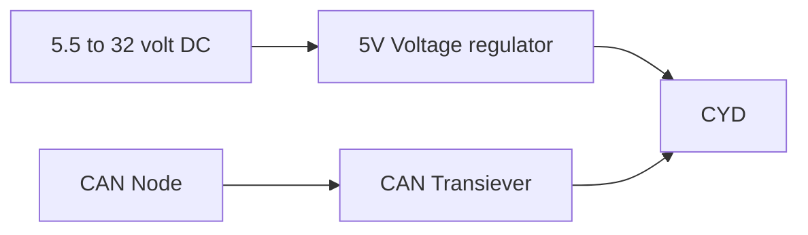

# 📟 CYD CAN DASH (ESP32)

**CYD CAN DASH** is a dynamic, high-performance CAN bus monitoring dashboard designed for the **Cheap Yellow Display (ESP32-2432S028R)**. Unlike static sniffers, this project uses an SD-card-based configuration system to decode and display specific signals from a **DBC (Database CAN)** file in real-time.


## ✨ Key Features

* Dynamic Signal Parsing: Decodes Motorola (Big Endian) bit-parsing logic directly from CAN frames.
* SD-Card Configuration: Hot-swap dashboard layouts by editing a configuration.json file—no recompilation required.
* Integrated Web Server: Download recorded log files or view file lists over Wi-Fi.
* Real-time Data Logging: Record incoming CAN traffic to .csv files on the SD card via the physical "BOOT" button.
* Interactive Controls: Send CAN messages using on-screen touch buttons resolved from DBC metadata.
* Hardware Diagnostics: Visual boot sequence verifying SD health, chip revision, and system memory.



---

## 🛠 Hardware Setup
Prototype board.


3D render of version 1 PCB.


## Component List

| Module                                   | Purpose     						 	| Link                                                         |
| :---------                               | :---------	 						 	| :--------------                                              |
| SN65HVD230 VP230 CAN Bus Transceiver     | Core processor and 2.8" TFT display 	| [Link to module](https://s.click.aliexpress.com/e/_c3WuskX7) |
| ESP32 Development Board 2.8inch **CYD**  | CAN Bus Transceiver (3.3V compatible)  | [Link to module](https://s.click.aliexpress.com/e/_c4rNTV7J) |
| Mini560 Pro 5A DC-DC Step Down 5V        | DC-DC Step Down (5V)					| [Link to module](https://s.click.aliexpress.com/e/_c37COh3J) |


## Wiring Table
| CYD Pin    | Transceiver Pin | Function     |
| :--------- | :-------------- | :----------- |
| **GPIO 22**| TX              | CAN Transmit |
| **GPIO 27**| RX              | CAN Receive  |
| **3V3**    | VCC             | Power        |
| **GND**    | GND             | Ground       |

---

## 💻 Software Architecture

The dashboard utilizes a two-tier JSON system to map binary bus data to human-readable information.

1. DBC to JSON Conversion
   
    The firmware parses JSON-formatted database files.
    Convert your .dbc file using the [Viriciti DBC-to-JSON converter](https://viriciti.github.io/dbc-to-json/).
    Place the resulting .json file (e.g., PDM.json) on the SD card root.

3. Configuration (configuration.json)
   
    Define which signals to display and which buttons to render.
```json
{
  "signals": [
    { "name": "BatteryVoltage", "mode": "text" },
    { "name": "EngineRPM", "mode": "bar" }
  ],
  "transmit_buttons": [
    { 
      "label": "FAN ON", 
      "signalName": "CoolingFanCmd", 
      "value": 1.0 
    }
  ],
  "external_references": {
    "dbc_json_map": "VehicleData.json"
  }
}
```

## 🚀 Installation
1. **Dependencies**: 
Install LovyanGFX, ArduinoJson, and ensure SPI, SD, and FS libraries are available.
2. **Display Configuration**: 
Update your LovyanGFX_CYD_Settings.h to match the CYD pinout (ILI9341/ST7789).
3. **CAN Speed**
The default speed is 500kbits/s. To change this, modify the timing config in `setup():`
`twai_timing_config_t t_config = TWAI_TIMING_CONFIG_250KBITS();`

---

## 🔍 Visual Indicators
The dashboard includes a status icon in the top-right corner:
* Green Triangle: System OK / Receiving Data.
* Orange Bars: Timeout (No messages received for >1s).
* Red Cross: Bus Error or Passive State.Blinking 
* Red Dot: Data logging (SD Recording) active.

✨ Future Roadmap
[ ] Touch Pagination: Swipe to switch between multiple signal pages.
[ ] Custom Gauges: High-refresh circular gauges for performance metrics.
[ ] WiFi Configuration: Edit the configuration.json directly via the web portal.
